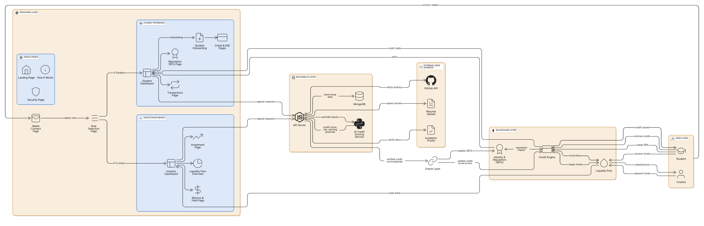
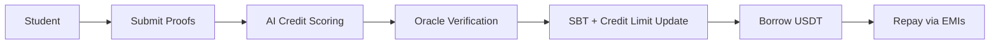
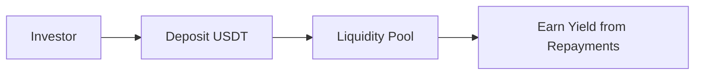

<div align="center">

# 🎓 Credora

### Education & Skill-Backed Credit Protocol

[](LICENSE)
[](https://reactjs.org/)
[](https://soliditylang.org/)
[](https://www.python.org/)

_Empowering students with credit based on potential, not collateral_

[📖 Documentation](#documentation) • [🚀 Quick Start](#quick-start) • [💡 How It Works](#how-it-works) • [🏗️ Architecture](#architecture)

</div>

---

## 📋 Table of Contents

- [Overview](#overview)
- [Problem Statement](#problem-statement)
- [Core Idea](#core-idea)
- [System Architecture](#architecture)
- [User Roles](#user-roles)
- [End-to-End Workflow](#end-to-end-workflow)
- [Security & Privacy](#security--privacy)
- [MVP Scope](#mvp-scope)
- [Round 2 Improvements](#round-2-improvements)
- [Tech Stack](#tech-stack)
- [Getting Started](#getting-started)

---

## 🌟 Overview

**Credora** is a decentralized finance (DeFi) protocol that provides small, unsecured USDT credit to students based on their **academic performance**, **skills**, and **future earning potential** — instead of traditional financial collateral or credit scores.

### Why Credora?

The protocol targets students who are **credit-invisible** despite having strong academic or technical potential. By combining:

- 🔗 Blockchain transparency
- 🤖 AI-based assessment
- 🎖️ Reputation-based identity (Soulbound Tokens)

Credora enables **fair and accessible credit** for essential student needs such as laptops, learning tools, and educational expenses.

---

## ⚠️ Problem Statement

Most students cannot access credit because:

- ❌ **No salary** or stable income
- ❌ **No credit history** (credit-invisible)
- ❌ **Traditional banks cannot evaluate potential**

As a result, students depend on parents or informal lending. **Credora addresses this gap** by replacing financial history with verified educational and skill signals.

---

## 💡 Core Idea

> **Replace financial collateral with verified education and skill-based reputation.**

### Borrowing Power Determined By:

- 📚 **Academic performance** (CGPA, semester progress)
- 💻 **Skill signals** (GitHub activity, projects, certifications)
- 🏆 **Internships and achievements**
- 📈 **Consistency and improvement over time**

**Formula:** Higher verified potential ⇒ Higher credit limit ⇒ Better loan terms

---

## 👥 User Roles

### 1. 🎓 Student (Borrower)

```
Connect Wallet → Complete Onboarding → Submit Proofs
    → Receive SBTs → Get Credit Limit → Borrow & Repay
```

**Key Actions:**

- Connect wallet
- Complete onboarding
- Submit academic and skill proofs
- Receive reputation Soulbound Tokens (SBTs)
- Get a USDT credit limit
- Borrow and repay via EMIs

### 2. 💼 Investor (Liquidity Provider)

**Key Actions:**

- Deposit USDT into liquidity pool
- Fund student loans
- Earn yield from repayments
- View pool health and returns

### 3. 🔧 Admin (Protocol Governor)

**Key Actions:**

- Manage protocol parameters
- No manual loan approvals
- Use multisig and timelocks
- Emergency pause authority only

---

## 🏗️ Architecture

<div align="center">

### System Architecture Diagram



_Complete end-to-end system architecture showing all layers and interactions_

</div>

The system follows a **layered architecture** with clear separation of concerns:

### 1. 🎨 Frontend Layer

**Built with:** React / Next.js with wallet-based authentication and role selection

#### 📄 Public Pages

- Landing Page
- How It Works
- Security Page
- Wallet Connect & Role Selection

#### 🎓 Student Interface

- Student Dashboard
- Onboarding Flow
- Reputation SBTs Page
- Credit Limit & EMI Overview
- Transactions Page

#### 💼 Investor Interface

- Investor Dashboard
- Liquidity Pool Overview
- Investment Page
- Returns & Yield Analytics

---

### 2. 🔧 Backend & AI Layer

#### API Server (Node.js)

- Handles signed frontend requests
- Manages onboarding sessions
- Coordinates AI scoring and verification

#### 🤖 AI Credit Scoring Service (Python)

- Reads GitHub profile data
- Parses resumes and certificates
- Evaluates academic proofs

**Outputs:**

- Credit score (1–100)
- Risk level
- Earning potential estimate

#### 🗄️ Database (MongoDB)

- Encrypted off-chain storage
- Stores documents and parsed metadata
- No sensitive data stored on-chain

---

### 3. 🔮 Oracle Layer

**Secure Bridge:** Between off-chain intelligence and on-chain logic

**Functions:**

- ✅ Verifies AI scoring results
- 🔏 Signs credit score payload
- 📤 Pushes verified data on-chain

**Updates:**

- Reputation SBTs
- Credit limit and expiry

---

### 4. ⛓️ Blockchain Layer (Smart Contracts)

#### 🎖️ Identity & Reputation Contract

- Issues Soulbound Tokens (SBTs)
- Represents academic and skill achievements
- Non-transferable identity layer

#### 💳 Credit Engine Contract

- Stores credit score and credit limit
- Enforces borrowing constraints
- Tracks outstanding debt and EMIs

#### 💰 Liquidity Pool Contract

- Accepts investor deposits
- Funds student credit
- Distributes yield
- Handles repayments and defaults

---

## 🔄 End-to-End Workflow

### 🎓 Student Borrow Flow



### 💼 Investor Flow



---

## 🔒 Security & Privacy

### Privacy Design

#### 🔐 Academic Documents Are Never Stored On-Chain

**Off-chain Processing:**

- ✅ Encrypted
- ✅ Stored off-chain
- ✅ Used only for scoring

**On-chain Data Includes Only:**

- Credit score
- Credit limit
- Expiry timestamp
- Oracle signature

### Security Mechanisms

| Mechanism                      | Description                                        |
| ------------------------------ | -------------------------------------------------- |
| 🚨 Emergency Pause             | Protocol can be paused in case of emergency        |
| 🔑 Access Control              | Role-based permissions for all operations          |
| ✍️ Oracle Signature Validation | All credit scores must be signed by trusted oracle |
| 🎖️ Non-transferable SBT        | Identity tokens cannot be transferred or sold      |

---

## 🎯 MVP Scope (Round 1)

### ✅ Completed Features

- [x] Student onboarding and dashboards
- [x] Investor dashboards and liquidity pool
- [x] AI-based basic credit scoring
- [x] Reputation SBT issuance
- [x] Credit limit assignment
- [x] Borrow and repay flow
- [x] Core smart contracts (testnet)
- [x] Complete system architecture and documentation

---

---

## 🚀 Round 2 Improvements

> **Focus:** Stability, usability, and production readiness (not major feature expansion)

### 1. 🛡️ Improved Error Handling & Reliability

**Enhancements:**

- Comprehensive frontend and backend error handling
- Graceful fallback for:
  - Oracle delays or failures
  - Invalid or incomplete academic submissions
- Clear user-facing error messages and recovery flows
- Backend request validation and rate limiting
- Safer smart contract state transitions

**Outcome:** _A resilient system that behaves predictably under failure scenarios_

---

### 2. ⚡ Smart Contract Optimization & Safety

**Gas Optimization:**

- Storage packing
- Reduced redundant writes
- Optimized modifiers and logic

**Architecture:**

- Clear separation between:
  - Identity & Reputation
  - Credit Engine
  - Liquidity Pool

**Safety:**

- Additional require checks and custom errors
- Improved event emission for indexing and analytics
- Stronger access control

**Outcome:** _Lower gas costs, safer execution, and improved auditability_

---

### 3. 🎨 UX & Interface Enhancements

**Improvements:**

- Smoother onboarding experience
- Clear progress indicators during verification
- Better dashboards for:
  - Credit usage
  - EMI schedules
  - Pool utilization and yield
- Loading states, confirmations, and alerts
- Mobile-responsive layouts

**Outcome:** _A fintech-grade user experience suitable for real users_

---

### 4. 🤖 Backend & Scoring Refinements

**Enhancements:**

- Better structuring of scoring inputs and outputs
- Modular and tunable scoring pipeline
- Improved data normalization for GitHub and academic inputs
- Logging and monitoring of scoring decisions
- Safer handling of partial or missing data

**Outcome:** _More consistent and explainable credit scoring_

---

### 5. 🔧 Developer Experience & Maintainability

**Improvements:**

- Cleaner separation of frontend, backend, AI, and blockchain code
- Improved README and setup documentation
- Environment-based configuration
- Reusable utilities and shared types
- Better code comments and naming consistency

**Outcome:** _Easier future development, testing, and collaboration_

---

### 6. 📊 Observability & Debugging

**Event-based Tracking:**

- Credit issuance
- Borrow and repay actions
- Liquidity movements
- Basic protocol health analytics
- Improved logging for backend and oracle services

**Outcome:** _Faster debugging and clearer insight into system behavior_

---

### 🎯 Round 2 Objective Summary

Round 2 focuses on transforming Credora from a **functional MVP** into a **robust, production-ready prototype** by improving:

- ✅ Reliability
- ✅ Efficiency
- ✅ Usability
- ✅ Maintainability

_While keeping the core architecture unchanged._

---

## 🛠️ Tech Stack

### Frontend

- **Framework:** React + TypeScript + Vite
- **Styling:** Tailwind CSS
- **UI Components:** shadcn/ui
- **Web3:** ethers.js / wagmi
- **State Management:** React Context

### Backend

- **API Server:** Node.js + Express
- **Database:** MongoDB
- **Authentication:** Wallet-based signing

### AI & Data Processing

- **Language:** Python 3.8+
- **Libraries:**
  - scikit-learn (ML models)
  - pandas (data processing)
  - GitHub API integration

### Blockchain

- **Smart Contracts:** Solidity 0.8.x
- **Framework:** Hardhat
- **Testing:** Hardhat + Chai
- **Network:** Ethereum Testnet (initial)

---

## 🚀 Getting Started

### Prerequisites

```bash
Node.js >= 16.x
Python >= 3.8
Git
MetaMask or compatible wallet
```

### Installation

1. **Clone the repository**

```bash
git clone https://github.com/Amanparashar-09/Credora.git
cd Credora
```

2. **Install Frontend Dependencies**

```bash
cd frontend
npm install
```

3. **Install Smart Contract Dependencies**

```bash
cd ../contracts
npm install
```

4. **Install AI Service Dependencies**

```bash
cd ../AI_Score_Engine
pip install -r requirements.txt
```

5. **Configure Environment Variables**

Create `.env` files in respective directories following the `.env.example` templates.

### Running the Application

**Frontend:**

```bash
cd frontend
npm run dev
```

**Smart Contracts (Local Network):**

```bash
cd contracts
npx hardhat node
npx hardhat run scripts/deploy.js --network localhost
```

**AI Scoring Service:**

```bash
cd AI_Score_Engine
python app/main.py
```

---

## 📖 Documentation

- [Smart Contract Documentation](./contracts/README.md)
- [AI Scoring Pipeline](./AI_Score_Engine/README.md)
- [Frontend Guide](./frontend/README.md)
- [API Documentation](./docs/API.md) _(coming soon)_

---

## 🤝 Contributing

We welcome contributions! Please see our [Contributing Guidelines](CONTRIBUTING.md) for details.

---

## 📄 License

This project is licensed under the MIT License - see the [LICENSE](LICENSE) file for details.

---

## 🌐 Connect With Us

- **GitHub:** [@Amanparashar-09](https://github.com/Amanparashar-09)
- **Project Repository:** [Credora](https://github.com/Amanparashar-09/Credora)

---

<div align="center">

## 💡 Conclusion

**Credora introduces a reputation-backed credit model** where education and skills directly translate into financial access.

By combining **AI-based assessment** with **blockchain transparency**, Credora enables **fair, trust-minimized credit** for students who are otherwise excluded from traditional financial systems.

**Building the future of education-backed finance** 🚀

---

Made with ❤️ by the Credora Team

</div>
