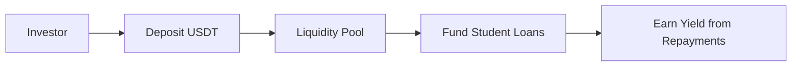

<div align="center">

# 🎓 Credora

### Education & Skill-Backed Credit Protocol

[](LICENSE)
[](https://reactjs.org/)
[](https://soliditylang.org/)
[](https://www.python.org/)

_Empowering students with credit based on potential, not collateral_

[📖 Documentation](#documentation) • [🚀 Quick Start](#getting-started) • [💡 How It Works](#end-to-end-workflow) • [🏗️ Architecture](#system-design--architecture)

</div>

---

## 📋 Table of Contents

- [Overview](#-overview)
- [Problem Statement](#%EF%B8%8F-problem-statement)
- [Core Idea](#-core-idea)
- [System Design & Architecture](#%EF%B8%8F-system-design--architecture)
- [Scalability & Reliability Plan](#-scalability--reliability-plan)
- [Team Contribution Breakdown](#-team-contribution-breakdown)
- [Execution Roadmap](#-execution-roadmap)
- [User Roles](#-user-roles)
- [End-to-End Workflow](#-end-to-end-workflow)
- [Security & Privacy](#-security--privacy)
- [Tech Stack](#%EF%B8%8F-tech-stack)
- [Getting Started](#-getting-started)

---
## [--**Demo Video Link**--](https://youtu.be/7GfEZQ55TVY)

## 🌟 Overview

**Credora** is a decentralized finance (DeFi) protocol that provides small, unsecured USDT credit to students based on their **academic performance**, **skills**, and **future earning potential** — instead of traditional financial collateral or credit scores.

### Why Credora?

The protocol targets students who are **credit-invisible** despite having strong academic or technical potential. By combining:

- 🔗 **Blockchain transparency**
- 🤖 **AI-based assessment**
- 🎖️ **Reputation-based identity** (Soulbound Tokens)

Credora enables **fair and accessible credit** for essential student needs such as laptops, learning tools, and educational expenses.

---

## ⚠️ Problem Statement

Most students cannot access credit because:

- ❌ **No salary** or stable income
- ❌ **No credit history** (credit-invisible)
- ❌ **No CIBIL / bureau score**
- ❌ **Traditional banks cannot evaluate potential**

As a result, students depend on parents or informal lending. **Credora addresses this gap** by replacing financial history with verified educational and skill signals.

---

## 💡 Core Idea

> **Replace financial collateral with verified education and skill-based reputation.**

### Borrowing Power Determined By:

- 📚 **Academic performance** (CGPA, semester progress)
- 💻 **Skill signals** (GitHub activity, projects, certifications)
- 🏆 **Internships and achievements**
- 📈 **Consistency and improvement over time**

**Formula:** Higher verified potential ⇒ Higher credit limit ⇒ Better loan terms

---

## 🏗️ System Design & Architecture

### High-Level Architecture

Credora follows a **layered architecture** with clear separation of concerns between frontend, backend, AI services, oracle layer, and blockchain:

```
┌────────────────┐      ┌──────────────────────┐      ┌──────────────────┐
│   Frontend     │ ───▶ │  Backend & Oracle    │ ───▶ │   Blockchain     │
│  (React/Vite)  │      │  (Node.js + Python)  │      │  (Smart Contracts│
└────────────────┘      └──────────────────────┘      └──────────────────┘
        ▲                         │                              │
        │                         ▼                              ▼
        │              Encrypted Database              USDT Liquidity Pool
        │           (Docs + Scores + Metadata)         Borrow / Repay / SBTs
        └──────────────────────────────────────────────────────────────────
```

### Core Components

#### 1. 🎨 Frontend Layer (React + TypeScript + Vite)

**Purpose:** User interface for students, investors, and admins

**Key Features:**

- Wallet-based authentication (MetaMask, WalletConnect)
- Role-based dashboards (Student, Investor, Admin)
- Document upload and onboarding flows
- Transaction management and credit limit visualization
- Real-time blockchain interaction

**Tech Stack:**

- React 18+ with TypeScript
- Vite for build tooling
- TailwindCSS + shadcn/ui for styling
- ethers.js / wagmi for Web3 integration
- React Context for state management

---

#### 2. 🔧 Backend API Layer (Node.js + Express)

**Purpose:** Coordinate services, manage sessions, and handle authentication

**Key Responsibilities:**

- Wallet signature verification
- Document upload and encryption (AES-256)
- Coordinate AI scoring requests
- Manage user profiles and sessions
- Interface with blockchain via oracle

**Tech Stack:**

- Node.js + TypeScript
- Express.js for HTTP API
- MongoDB for encrypted off-chain storage
- JWT for session management
- Multer for file uploads

**API Endpoints (Examples):**

- `POST /api/auth/login` — Authenticate users via wallet signature
- `GET /api/students/:id/profile` — Fetch student profile and score
- `POST /api/student/documents/upload` — Upload encrypted documents
- `POST /api/score/compute` — Submit data for AI scoring (internal)
- `GET /api/investor/portfolio` — Get investor portfolio details

---

#### 3. 🤖 AI/Scoring Engine (Python)

**Purpose:** Compute credit scores from academic and skill signals

**Data Sources:**

- GitHub profile (commits, repos, languages, activity)
- Resume PDF (skills, projects, experience)
- Academic records (GPA, semester completion)
- Internships and certifications

**Feature Engineering:**

- **GitHub Features:** Commit frequency, active months, language diversity
- **Code Features:** CodeBERT embeddings for semantic code quality
- **Resume Features:** SBERT embeddings for skill depth and market alignment
- **Academic Features:** Normalized GPA and internship count

**Scoring Model:**

- Weighted linear combination of 10 features
- Transparent, explainable scoring (no black-box)
- Output: Credit score (0-100) + risk level + earning potential

**Tech Stack:**

- Python 3.8+
- FastAPI for REST interface
- sentence-transformers (SBERT)
- transformers (CodeBERT)
- scikit-learn for feature processing
- PyMuPDF for resume parsing

---

#### 4. 🔮 Oracle Layer

**Purpose:** Secure bridge between off-chain intelligence and on-chain logic

**Functions:**

- Verify AI scoring results
- Sign credit score payloads using EIP-712
- Push verified attestations to blockchain
- Update credit limits and SBT metadata

**Security:**

- Private key management (HSM / secure vault)
- Rate limiting and request validation
- Signature verification on-chain

---

#### 5. ⛓️ Blockchain Layer (Solidity Smart Contracts)

**Smart Contracts:**

##### a) 🎖️ Identity & Reputation Contract

- Issues Soulbound Tokens (SBTs) representing achievements
- Non-transferable identity layer
- Stores reputation metadata

##### b) 💳 Credit Engine Contract

- Stores credit score and limit per user
- Enforces borrowing constraints
- Tracks outstanding debt and EMIs
- Accepts oracle-signed attestations only

##### c) 💰 Liquidity Pool Contract

- Accepts USDT deposits from investors
- Funds student loans
- Distributes yield from repayments
- Handles defaults via reserve fund

##### d) 🛡️ Reserve / Insurance Fund

- Absorbs losses from defaults
- Protects depositor capital
- Funded via protocol fees and interest spread

**Tech Stack:**

- Solidity 0.8.x
- Hardhat for development and testing
- OpenZeppelin contracts for standards
- ethers.js for integration
- Deployed on Ethereum-compatible testnets

---

### Data Flow

**Complete User Journey:**

1. **User uploads documents** on the frontend (resume, certificates, academic records)
2. **Backend receives documents**, encrypts them (AES-256), stores off-chain in MongoDB
3. **Backend enqueues scoring job** to AI/Scoring Engine with student data
4. **AI Engine** fetches GitHub data, parses resume, extracts features, computes embeddings
5. **AI Engine returns** credit score (0-100) + explainability factors + risk assessment
6. **Oracle service** verifies score, signs EIP-712 attestation payload
7. **Oracle pushes attestation** to blockchain Credit Engine contract
8. **Smart contract** validates signature, updates credit limit and expiry
9. **SBT minted** or updated with new reputation metadata
10. **Student can borrow USDT** up to their credit limit
11. **Repayments** update debt, distribute yield to investors

---

### Component Diagram

<div align="center">


## </div>

## 📈 Scalability & Reliability Plan

### Handling Increased User Load

**Horizontal Scaling:**

- Scale stateless frontend and backend services behind a load balancer
- Deploy multiple AI/Scoring Engine workers with autoscaling based on queue depth
- Use managed database with read replicas for high read throughput

**Database Optimization:**

- Partition large tables (transactions, credit history) by user ID or timestamp
- Index frequently queried fields (wallet address, credit score, timestamps)
- Use connection pooling and query optimization

**Compute Offloading:**

- Offload heavy ML embeddings (CodeBERT, SBERT) to GPU-backed instances
- Use managed ML endpoints (e.g., SageMaker, Azure ML) for production inference
- Cache embedding results for frequently accessed profiles

---

### Performance Optimization

**Caching Strategy:**

- **Redis** for session data, frequently read profiles, and computed scores
- Cache GitHub API responses to reduce external API calls
- Edge caching for static assets via CDN

**Asynchronous Processing:**

- Background workers (Celery / RQ / Bull) for long-running jobs (scoring, document processing)
- Batch and debounce scoring requests to group smaller jobs
- Message queues (RabbitMQ / Redis Streams) for job distribution

**API Optimization:**

- API response compression (gzip)
- Pagination for large result sets
- GraphQL or selective field queries to reduce payload size

**CDN & Edge Caching:**

- Serve static frontend assets via CDN (Cloudflare, Fastly)
- Cache public API responses at edge locations
- Reduce latency for global users

---

### Failures and Recovery

**Resilience Patterns:**

- **Circuit breakers** for third-party API calls (GitHub, blockchain nodes)
- **Retries with exponential backoff** for transient failures
- **Graceful degradation:** Fall back to cached scores if AI engine is temporarily unavailable

**Health Monitoring:**

- Health check endpoints (`/health`, `/health/detailed`) for all services
- Liveness and readiness probes for container orchestration (Kubernetes)
- Automated restarts on failure

**Data Backup & Recovery:**

- **Database backups:** Daily automated backups with point-in-time recovery
- **Object storage lifecycle:** Versioning and retention policies for documents
- **Disaster recovery plan:** Cross-region replication for critical data

**Observability:**

- **Centralized logging** (ELK Stack / Datadog / CloudWatch)
- **Metrics and monitoring** (Prometheus + Grafana)
- **Alerting** based on SLOs/SLIs (response time, error rate, availability)
- **Distributed tracing** (OpenTelemetry / Jaeger) for request flows

---

### Security

**Data Security:**

- **Encryption at rest:** AES-256 for documents and sensitive data
- **Encryption in transit:** TLS/SSL for all API and blockchain communications
- **Server-side encryption** for object storage (S3-compatible)

**Access Control:**

- **Role-based access control (RBAC)** for API endpoints
- **Wallet signature authentication** (EIP-191) for all user actions
- **JWT tokens** with short expiry and refresh mechanisms

**Smart Contract Security:**

- **Access control** (Ownable, AccessControl patterns)
- **Reentrancy guards** and checks-effects-interactions pattern
- **Emergency pause** mechanism for critical failures
- **Rate limiting** to prevent abuse

**Key Management:**

- Store oracle and admin private keys in secure vaults (Azure Key Vault / AWS KMS / HashiCorp Vault)
- Never expose private keys in code or logs
- Use HSMs (Hardware Security Modules) for production

---

## 👥 Team Contribution Breakdown

### Development Team

**Aman Parashar** — _Project Lead & Full-Stack Developer_

- Frontend development & design (React, UI/UX, responsive layouts)
- Wallet integration & blockchain interactions (SBTs, credit engine, transaction flows)
- Smart contract development, testing, and deployment scripts
- Repository management and overall project coordination

**Uday Bansal** — _AI/ML Engineer & Scoring Lead_

- AI credit scoring pipeline design and implementation
- Feature engineering (GitHub, resume, academic signals)
- Model training, embeddings (CodeBERT, SBERT), and evaluation
- Explainability and scoring transparency

**Divyansh Patel** — _Backend Engineer & Blockchain Integration_

- Backend API server (Node.js + Express + MongoDB)
- Database design and encryption services
- Worker/queue systems for async processing
- Backend-to-blockchain oracle integration and transaction handling

**Pratham Chaturvedi** — _Research, Documentation & QA_

- Project research and technical feasibility analysis
- Documentation writing (README, architecture diagrams, API docs)
- Test planning and quality assurance coordination
- Non-technical coordination and presentation materials

---

## 🗺️ Execution Roadmap

### Phase 0 — Round 1 (Prototype) ✅ _Completed_

**Deliverables:**

- ✅ Working frontend demo with student and investor dashboards
- ✅ Backend API endpoints for authentication, profiles, and documents
- ✅ AI scoring engine prototype with basic feature extraction
- ✅ Smart contracts deployed on testnet
- ✅ Sample on-chain attestation flow
- ✅ End-to-end demo with sample users and synthetic data

**Success Criteria:**

- Functional MVP demonstrating core concept
- All major components integrated

---

### Phase 1 — Hardening & MVP (Weeks 5-10)

**Focus:** Stability, error handling, and user experience improvements

**Deliverables:**

- Enhanced error handling and validation (frontend + backend)
- Improved onboarding flow with progress indicators
- Better AI scoring model with tunable parameters
- Smart contract gas optimization and safety improvements
- Basic logging and monitoring setup

**Success Criteria:**

- System handles edge cases gracefully
- Improved UX based on initial feedback
- Lower gas costs for transactions

---

### Phase 2 — Production Readiness (Weeks 11-16)

**Focus:** Security, scalability, and deployment infrastructure

**Deliverables:**

- Comprehensive security audit of smart contracts
- Implement autoscaling for backend and AI services
- Set up managed database with backups and replication
- Add caching layers (Redis) and CDN integration
- Secrets management via secure vault
- Rate limiting and DDoS protection
- Advanced monitoring, alerting, and observability

**Success Criteria:**

- Pass security audit with no critical issues
- System can handle 10x current load
- 99.5% uptime SLA
- Full observability stack operational

---

### Phase 3 — Scaling & Growth (Weeks 17-24)

**Focus:** Global expansion and advanced features

**Deliverables:**

- Multi-region deployment for low latency
- Global CDN for frontend assets
- Database sharding and partitioning for scale
- Model retraining pipelines with real repayment data
- Advanced features:
  - Lender dashboards with analytics
  - Explainability UI for credit scores
  - Fraud detection signals and anomaly detection
  - Integration with real universities for verification

**Success Criteria:**

- Support 100k+ users across multiple regions
- < 200ms API response time globally
- Continuous model improvement with real data

---

### Timeline Summary

| Phase                         | Duration    | Status         |
| ----------------------------- | ----------- | -------------- |
| Phase 0: Prototype            | Days 0-3   | ✅ Complete    |
| Phase 1: MVP Hardening        | Days 4-8  | 🚧 In Progress |
| Phase 2: Production Readiness | Days 9-13 | 📅 Planned     |
| Phase 3: Scaling & Growth     | Days 14-16 | 📅 Planned     |

---

## 👥 User Roles

### 1. 🎓 Student (Borrower)

**User Journey:**

```
Connect Wallet → Complete Onboarding → Submit Proofs
    → Receive SBTs → Get Credit Limit → Borrow & Repay
```

**Key Actions:**

- Connect MetaMask or compatible wallet
- Complete multi-step onboarding
- Submit academic documents and proofs
- Receive reputation Soulbound Tokens (SBTs)
- Get a USDT credit limit based on AI score
- Borrow USDT and repay via EMIs

---

### 2. 💼 Investor (Liquidity Provider)

**Key Actions:**

- Deposit USDT into liquidity pool
- Fund student loans automatically
- Earn yield from repayments and interest
- View pool health, utilization, and returns
- Withdraw liquidity (subject to pool availability)

---

### 3. 🔧 Admin (Protocol Governor)

**Key Actions:**

- Manage protocol parameters (interest rates, caps, limits)
- Monitor system health and default rates
- Emergency pause authority (security only)
- No manual loan approvals (fully automated)
- Use multisig and timelocks for governance

---

## 🔄 End-to-End Workflow

### 🎓 Student Borrow Flow


**Detailed Steps:**

1. Student connects wallet and completes onboarding
2. Uploads academic documents, resume, GitHub username
3. Backend encrypts and stores documents off-chain
4. AI engine fetches GitHub data, parses documents, computes score
5. Oracle verifies and signs credit score attestation (EIP-712)
6. Smart contract validates signature and updates credit limit
7. SBT minted/updated with reputation metadata
8. Student can borrow up to their credit limit
9. EMI repayments update debt and distribute yield

---

### 💼 Investor Flow



**Detailed Steps:**

1. Investor connects wallet and deposits USDT to pool
2. Receives pool shares (ERC-4626 style)
3. USDT automatically allocated to student loans
4. Earns interest from student repayments
5. Can withdraw liquidity + earned interest

---

## 🔒 Security & Privacy

### Privacy Design Principles

#### 🔐 Academic Documents Are Never Stored On-Chain

**Off-chain Storage:**

- ✅ Documents are encrypted (AES-256)
- ✅ Stored in MongoDB with access controls
- ✅ Used only for scoring computation
- ✅ Can be deleted upon user request

**On-chain Data Includes Only:**

- Credit score (integer 0-100)
- Credit limit (in USDT)
- Expiry timestamp
- Oracle signature (for verification)
- SBT metadata (achievement types, levels)

This ensures **privacy** while maintaining **verifiability**.

---

### Security Mechanisms

| Mechanism                    | Description                                                  |
| ---------------------------- | ------------------------------------------------------------ |
| 🚨 **Emergency Pause**       | Protocol can be paused in case of exploit or critical bug    |
| 🔑 **Access Control**        | Role-based permissions (Student, Investor, Admin, Oracle)    |
| ✍️ **Oracle Signature**      | All credit scores must be signed by trusted oracle (EIP-712) |
| 🎖️ **Non-transferable SBT**  | Identity tokens cannot be transferred or sold (Soulbound)    |
| 🔒 **Wallet Authentication** | EIP-191 signature verification for all user actions          |
| 🛡️ **Reentrancy Guards**     | Prevents reentrancy attacks in smart contracts               |
| 📊 **Rate Limiting**         | API and contract rate limits to prevent abuse                |

---

## 🛠️ Tech Stack

### Frontend

- **Framework:** React 18+ with TypeScript
- **Build Tool:** Vite
- **Styling:** Tailwind CSS + shadcn/ui components
- **Web3:** ethers.js / wagmi
- **State Management:** React Context API
- **Routing:** React Router

### Backend

- **Runtime:** Node.js 16+
- **Framework:** Express.js + TypeScript
- **Database:** MongoDB (encrypted documents)
- **Authentication:** Wallet signature (EIP-191) + JWT
- **File Upload:** Multer
- **Encryption:** crypto (AES-256-GCM)

### AI & Data Processing

- **Language:** Python 3.8+
- **API Framework:** FastAPI
- **ML Libraries:**
  - sentence-transformers (SBERT)
  - transformers (CodeBERT)
  - scikit-learn (feature processing)
- **Data Processing:** pandas, numpy
- **Document Parsing:** PyMuPDF (fitz)
- **API Integration:** requests (GitHub API)

### Blockchain

- **Smart Contracts:** Solidity 0.8.x
- **Framework:** Hardhat
- **Testing:** Hardhat + Chai + Waffle
- **Libraries:** OpenZeppelin Contracts
- **Network:** Ethereum-compatible testnets (Sepolia, Mumbai)
- **Integration:** ethers.js

### DevOps & Infrastructure

- **Containerization:** Docker + Docker Compose
- **CI/CD:** GitHub Actions
- **Monitoring:** Prometheus + Grafana
- **Logging:** Winston (backend), console (frontend)
- **Caching:** Redis (planned)
- **CDN:** Cloudflare or similar (planned)

---

## 🚀 Getting Started

### Prerequisites

Ensure you have the following installed:

```bash
Node.js >= 16.x
Python >= 3.8
Git
MetaMask or compatible Web3 wallet
```

### Installation

1. **Clone the repository**

```bash
git clone https://github.com/Amanparashar-09/Credora.git
cd Credora
```

2. **Install Frontend Dependencies**

```bash
cd frontend
npm install
```

3. **Install Backend Dependencies**

```bash
cd ../backend
npm install
```

4. **Install Smart Contract Dependencies**

```bash
cd ../contracts
npm install
```

5. **Install AI Service Dependencies**

```bash
cd ../AI_Score_Engine
pip install -r requirements.txt
```

### Configuration

Create `.env` files in respective directories:

**Frontend (.env):**

```env
VITE_BLOCKCHAIN_RPC_URL=http://127.0.0.1:8545
VITE_API_URL=http://localhost:5000
```

**Backend (.env):**

```env
PORT=5000
MONGODB_URI=mongodb://localhost:27017/credora
JWT_SECRET=your-secret-key
BLOCKCHAIN_RPC_URL=http://127.0.0.1:8545
CREDIT_REGISTRY_ADDRESS=0x...
CREDORA_POOL_ADDRESS=0x...
ATTESTER_PRIVATE_KEY=0x...
AI_ENGINE_URL=http://localhost:8000
```

**AI Engine (.env):**

```env
GITHUB_TOKEN=your-github-token
```

### Running the Application

**1. Start Local Blockchain (Terminal 1):**

```bash
cd contracts
npx hardhat node
```

**2. Deploy Smart Contracts (Terminal 2):**

```bash
cd contracts
npx hardhat run scripts/deploy-and-setup.js --network localhost
```

Copy the deployed contract addresses to backend `.env` file.

**3. Start Backend API (Terminal 3):**

```bash
cd backend
npm run dev
```

**4. Start AI Scoring Service (Terminal 4):**

```bash
cd AI_Score_Engine
uvicorn app.main:app --reload
```

**5. Start Frontend (Terminal 5):**

```bash
cd frontend
npm run dev
```

Open your browser at `http://localhost:5173`

### Testing

**Smart Contracts:**

```bash
cd contracts
npx hardhat test
```

**Backend:**

```bash
cd backend
npm test
```

**AI Engine:**

```bash
cd AI_Score_Engine
python backend_test.py
```

---

## 📖 Documentation

- [Backend API Documentation](./backend/README.md)
- [AI Scoring Pipeline](./AI_Score_Engine/README.md)
- [Smart Contracts Guide](./contracts/README.md)
- [Frontend Guide](./frontend/README.md)

---

## 🤝 Contributing

Contributions are welcome! Please follow these steps:

1. Fork the repository
2. Create a feature branch (`git checkout -b feature/amazing-feature`)
3. Commit your changes (`git commit -m 'Add amazing feature'`)
4. Push to the branch (`git push origin feature/amazing-feature`)
5. Open a Pull Request

---

## 📄 License

This project is licensed under the MIT License - see the [LICENSE](LICENSE) file for details.

---

## 🌐 Connect With Us

- **GitHub:** [@Amanparashar-09](https://github.com/Amanparashar-09)
- **Project Repository:** [Credora](https://github.com/Amanparashar-09/Credora)

---

<div align="center">

## 💡 Conclusion

**Credora introduces a reputation-backed credit model** where education and skills directly translate into financial access.

By combining **AI-based assessment** with **blockchain transparency**, Credora enables **fair, trust-minimized credit** for students who are otherwise excluded from traditional financial systems.

**Building the future of education-backed finance** 🚀

---

Made with ❤️ by the Credora Team

</div>
